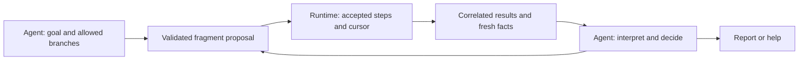
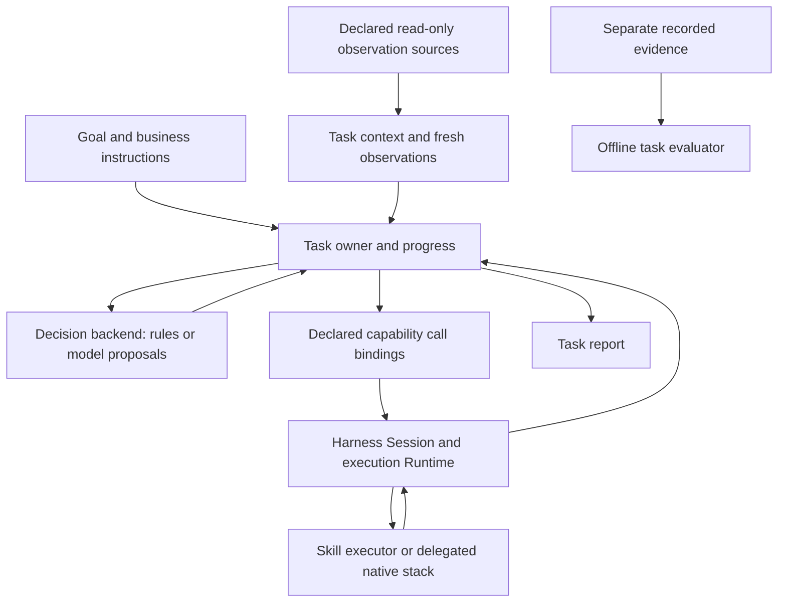

# Robot Agent architecture

Status: **private fixed-navigation slice implemented; broader design remains a candidate, 2026-10-08**. This document separates the implemented
architecture from the proposed next increment. It does not add an API, qualify a
new robot task, or change existing application or Harness contracts.

Comparative embodied-system research now informs this responsibility design.
Inspection implementation and repository extraction remain paused while
overall boundaries, implementation alternatives and targeted reference-validation
scope are discussed. The fragment contract and camera feasibility work remain
candidates after that architectural review.
No fragment interface or new robot capability is delivered by this proposal.

Robot Agent turns a goal and fresh observations into a bounded sequence of
skills, incorporates results and business instructions, and reports what remains
unresolved. Robot Harness owns execution authority, native work and settlement.
Native robot stacks retain control and device protection. Core belongs to Harness.
A model proposes decisions; it is not the task owner or the execution authority.

## Place in the embodied system

Agent includes a **cognitive harness**: task context, model/tool proposals,
business policy, feedback and reporting. The Robot Harness product provides an
**execution Runtime**: admitted operations, correlation, authority, cancellation
and settlement within its declared profiles. These uses of “harness” describe
different responsibilities; neither product must absorb the other.

The system target combines Agent, execution Runtime, skill executors, observations,
a final motion gateway and platform management. Logical modules do not prescribe
repository or process counts. Keep the two existing product repositories;
an integration repository is a candidate for combined design, pinned combinations,
launchers, CI and demos. Skills, motion and platform components should be extracted
when concrete independent use or deployment needs justify them. No new repository,
gateway, persistent ledger or platform supervisor is implemented by this proposal.

Today the application loop advances task steps. Runtime governs the operations
it receives. If a future accepted plan delegates step progression to Runtime,
define that delegation, plan revision and reconciliation before moving ownership.
Agent retains business decisions; it must not independently drive the same steps
alongside a Runtime mission engine.

An Agent **skill binding** calls a capability and interprets its correlated outcome.
A **skill executor** prepares and runs that capability, handles bounded native
recovery and supplies actual closure observations. Executors may be hosted by
Harness integrations or delegated to existing robot stacks. A learned skill's
policy worker is distinct from the business Agent and its LLM/VLM proposal backend.
Current ACT packaging is a pinned integration, not a general Skill SDK.

Platform health can constrain execution; it is not another business planner.
Final device output and manual takeover belong to the declared motion gateway and
native controller, not to model proposals. Existing scoped simulation protection
does not establish a complete device gateway, hard stop bound or restart recovery.

### Explicit execution fragments (design only)

Retain direct per-capability Session calls for existing applications. Add a
separate target mode where Agent explicitly delegates a bounded execution fragment
and receives control at a declared return point. A fragment is a finite accepted
sequence such as `Navigate(A) -> Observe(A) -> return facts to Agent`, not a new
business goal or arbitrary model-generated program. The first target is sequential
and allows at most one active effectful invocation; no generic DAG, concurrent
fleet scheduler or persistent task engine is proposed for that increment.

Agent owns the user goal, permitted business branches, task budget and goal
revision. Runtime owns an accepted fragment's version, execution cursor and
correlated invocation results. It can advance the fragment without waiting for
another model call. Agent must not submit the same fragment's next step itself.
Existing direct-call tasks retain their current step owner and qualification.

At a return point Agent interprets the supplied facts and decides whether to
finish, ask for help or submit another allowed fragment. For example, Runtime
obtains the image at A; Agent decides whether its interpretation warrants B.
Fragment completion does not establish business success, device stopping or full
resource cleanup. Unknown submission/native outcome or profile-specific pending
settlement cannot be converted into readiness for another effectful invocation.

An accepted fragment can be revised only against its current version and active
invocation. The first design uses closure of the old fragment and explicit
readiness before a new fragment, rather than general hot replacement. A late
proposal cannot alter the new goal, and an old cancellation cannot target a new
invocation. Existing navigation revision behavior keeps its separate contract.
No fragment API, serialized plan format or durable recovery protocol exists today.




## Implemented foundation and gaps

| Responsibility | Current implementation | Remaining gap |
|---|---|---|
| Goal, phase, bounded progress and task report | [HandoffTask](../src/robot_agent/handoff.py), [NavigationTask](../src/robot_agent/navigation.py) and concrete navigation variants | Application-specific loops; no shared Agent task engine or general task specification |
| Observation filtering and proposal grounding | Application `measurements`, identity checks and post-proposal revalidation | No common task-context/fact representation; camera/joints and map observations remain distinct |
| Model proposals | [CodexDecision](../src/robot_agent/codex_decision.py), [NavigationCodexDecision](../src/robot_agent/navigation_decision.py), controlled proposals and host relay | Shared bounded subprocess transport, but task-specific prompts/schemas; no qualified general planner or interchangeable multi-model service |
| Execution consumption | Public Harness Session; private navigation execution helper reused by checkpoint/revision/recovery | No shared cross-application skill contract; Nav2 and ALOHA close/reuse semantics differ |
| Outcome assessment | Installed ALOHA and fixed-normal-navigation offline evaluators | Task-specific qualification only; no general verifier or broad reliability evidence |

This is our own business Agent code using Codex as one proposal backend. It is
more than calling a model, but it is not yet a complete reusable Agent architecture.
Adding prompts or another navigation subclass alone will not close that gap.
Existing runnable contracts remain in [Applications](README.md); measured scope
remains in [Testing](TESTING.md). There is no supported shared task engine today.

## Proposed responsibility boundaries

These are responsibilities within the Agent product, not five services or a
requirement to create a class for every box. Initially keep one serial task owner.



| Responsibility | Owns | Does not own |
|---|---|---|
| Task definition and policy | Accepted goal, permitted skills/sites, completion conditions, bounded branches and budgets | Native safety profile, raw control commands or arbitrary model-authored executable plans |
| Task owner | Current phase, outstanding request identity, remaining budget, proposal validation, instruction priority and permitted next step | Core authority or an independent copy of native settlement state |
| Task context | Current task facts, their sensor/receipt provenance, completed work and unresolved outcomes | Hidden simulator truth, persistent recovery authority or a general world model |
| Decision backend | A bounded proposal from declared context and measurements; deterministic baseline or explicit model adapter | Session handles, reset, direct tools, robot access or authoritative success claims |
| Skill bindings | Explicit allowed arguments, observation/action distinction, preconditions, request/feedback association and backend-specific outcome handling | A second executor, ROS control loop, automatic replay or universal close/stop guarantee |

Task policy belongs to the application. Shared mechanisms should capture
proven repetition in task-local budget, proposal binding and reporting; they
should not erase domain-specific observation or closure semantics. A small
explicit skill set is sufficient. No dynamic plugin loader is needed now.

### Cognitive loop and model adapters

Separate task policy from shared cognitive mechanics. A task definition grounds
supported goals, allowed skills and completion conditions. A task owner manages
business intent and the remaining original budget. Task context retains observed
facts, model interpretations, completed work and unresolved execution references.
A decision adapter supplies a proposal; validation and skill bindings mediate its
use. Reporting describes both business progress and unresolved execution facts.
These are module responsibilities, not a required service for every box.

The cognitive loop is: obtain relevant facts, construct bounded context, propose,
validate against the current goal/input and budget, submit through the execution
boundary, incorporate the correlated result, then interpret or replan. In fragment
mode it waits for the declared return point instead of driving each accepted step.
A task-local memory can retain prior facts, but an old memory entry is not a fresh
sensor sample. No persistent memory store, learning loop or autonomous code change
is introduced by this design.

Codex, an API model, a local model and a deterministic decision baseline are
adapter options. The model does not own task state, execution resources or a
Session handle. The adapter must declare the concrete task's input/output,
timeout and cleanup behavior; model quality is qualified separately. Current
Codex transports and task-specific schemas are starting points, not a supported
universal planner interface.

The implemented private proposal subprocess now bounds prompt input to 1 MiB
of UTF-8 before launch and writes the pipe without blocking its owner. Input
backpressure uses the same cancellation signal and original deadline; completed
JSON decoding is followed by another cancellation/expiry check. The existing
owner still terminates, kills when necessary and reaps the child. This transport
repair does not implement the proposed shared task owner, decision thread or
serialized Session I/O owner. See [input and exit checks](TESTING.md#proposal-input-and-exit-checks)
for qualification limits.

Business reasoning, observation interpretation and action inference may use
different models. A detector/ASR can provide labelled estimates or inputs; a VLA
runs inside a skill backend with its action queue and lifecycle; native navigation
and protection keep their own control loop. They need not all share the business
Agent's provider or process.


### Data and decision path

1. The application grounds a user request into its supported goal and bounded
   choices. Unsupported sites/skills require clarification, not fabricated capabilities.
2. Obtain declared measurements and retain their actual source, identity and time.
   A task-local fact includes what was observed, where and when; an inference
   remains labelled as an inference. Do not put evaluator truth into this context.
3. Build the bounded proposal input from that context, allowed actions and the
   remaining original budget. Preserve each application's observation schema.
4. Validate the returned task/phase/observation identity and permitted action;
   revalidate relevant fresh measurements and capability before submission.
5. Submit through Harness with the existing request identity rules. Retain an
   ambiguous outstanding request rather than replaying it. Consume correlated
   progress/native outcomes/Owner receipts without manufacturing release.
6. Update task facts and select a permitted branch, finish, or ask for help.
   Business instructions and cancellation can withdraw a proposal. A model reply
   cannot revive the cancelled task or refresh its original budget.
7. Produce the task report. Offline evaluation consumes separately recorded
   evidence and does not feed the ongoing decision loop or confer authority.

### Ownership and lifecycle

The launcher/caller owns Session startup or connection, decision-backend resources,
sensor-source resources and close. The task owner borrows them for one bounded
run. Harness/native owners own action execution and its actual closure. A sensor
binding may acquire an image but cannot use that access to submit movement.

Keep one outstanding actuating request in the first new task. Read-only operations
have explicit deadlines and provenance but do not allocate Core movement authority.
A read-only skill may fail independently; it cannot imply that a previous action
has stopped. Domain-specific public capabilities determine whether a subsequent
actuating skill is available. `pending`, timeout, lost connection and unknown
submission are not permission to proceed with another action.

Task status, perception assessment, native outcome, Owner-reported settlement and
process cleanup remain separate. An Agent reporting a completed sequence is not
an independent physical-success verdict. Preserve the current qualified result
limits, including final navigation B pending and unknown complete native cleanup.

### Models and deployment

Keep the existing injected `decide(context, observation, deadline, stop_requested)`
shape as a starting point; it is not a new common public schema. Codex is an
initial adapter, not an Agent architecture dependency. A later local model or API
adapter must implement the concrete task's input/output contract and have its own
quality, timeout, cost and lifecycle qualification. Merely implementing the method
is not evidence of comparable decision quality or bounded remote cleanup.

Business LLM/VLM proposals, sensor interpretation, learned VLA skills and native
navigation/control models have different owners. Do not force them through one
business planner. Task-local context can later support memory or RSI experiments;
this proposal does not introduce cross-restart memory, autonomous code changes,
training, vector storage, model serving or a Robot OS deployment supervisor.

## Candidate integration task: mobile visual inspection (paused)

Proposed bounded goal: **visit registered A, inspect a visible status marker;
finish with a report if normal, or visit registered B once for a second inspection
if abnormal. Ask for help if the observation or execution state is uncertain.**

This tests navigation plus sensor interpretation and a result-driven business
branch. The marker is an explicit simulation test asset, not a production fault
detector. Navigation, normal/abnormal/uncertain interpretation and reporting are
three concrete responsibilities; no new manipulation or third motion goal is needed.

- At A: require the existing correlated arrival/release and fresh map feedback;
  acquire a robot-camera image with station/session/time association.
- A normal observation ends this inspection task at A. An abnormal observation
  permits one B visit only after public execution readiness and fresh revalidation.
  An absent/stale/foreign/uncertain image asks for help; it does not default to B.
- At B: require correlated arrival and fresh feedback, then one read-only inspection
  under its declared sensor contract. This does not turn B's pending settlement
  into release or permit another actuating operation.
- Retain the two inspection observations and interpretation provenance in the
  report. At most two navigation submissions and two declared image acquisitions;
  no automatic action retry, robot reset or unbounded search.

Use actual robot-camera sensor output. A rendered overview, evaluator image,
fixture image or simulator status bit is not a robot observation. RGB plumbing,
viewpoint/marker visibility and timing have not yet been qualified in the current
navigation setup. The public NavigationSession currently declares map pose/time/
health; it has no public navigation camera capability. Do not pretend it already
supports this task or silently add camera data to its existing schema.

After the system boundary and task contract mapping, verify a bounded camera/marker
path in the existing Ubuntu22.04/Humble/Gazebo
Docker environment. If unsupported, report that gap and choose a justified asset
or sensor adaptation; do not claim the task qualified or automatically switch to
Isaac/RTX. Decide the minimal read-only observation binding and its owning project
from that evidence before implementing it. ALOHA camera support does not establish
navigation-camera support.

Start with controlled proposals and a deterministic interpretation baseline on the
explicit marker; then qualify one explicit visual model on actual images. The
existing visual proposal adapter is a reusable starting point, not a ready navigation
inspection backend. Its new schema, host-image path and remaining-budget handling
need design and validation. Compare correct/uncertain decisions and cost within
this task; no broad model benchmark or automatic model selection is proposed.

The installed fixed A→B evaluator cannot evaluate this new goal or its A-only
branch. Design a task-specific extension with one evaluator per run, separating
registered-site arrival from marker-interpretation correctness and complete/unknown
execution. Ground-truth marker state is retained only for offline evaluation.
Each new visible feature should have a same-run video and accurate version/scope;
existing navigation recordings cannot qualify or demonstrate inspection.

## Current shared-mechanism candidate

A focused independent design review found the limited first slice ready for
implementation. This is design readiness, not qualification of a new coordinator
or approval to switch the public default.

The current first architecture slice uses the existing fixed navigation A-to-B
task and ALOHA transfer400-to-hold50 task. Inspection, camera acquisition and
fragment delegation remain paused candidates. The first slice preserves direct
per-capability Session calls; Agent continues to advance business steps, while
Harness retains operation authority and settlement. No new mission engine,
public Session protocol or repository is selected for this slice.

Proposed assembly is one application with a business coordinator, a decision
worker and a sole Session I/O owner. The coordinator alone applies task-policy
updates; workers return associated results. A task-local condition/short lock
protects bounded command/completion slots and control intentions. Long calls,
strategy evaluation and joins run outside that lock. Task stop stays latched;
revision withdrawal targets its original decision or execution request. A command
withdrawn before claim makes no Session call; after claim its possible effects
remain associated with the original request, without replay. Completed execution
facts and owner-close outcomes are retained separately. Business deadlines do not
refresh; required cleanup retains its own declared software waits.

Migration starts with the proposal-helper repair and platform CI, then a private
coordinator consumed through an experimental fixed-navigation entry, followed by
actual ALOHA reuse. Existing public task entries remain on their original paths
until separate installation, behavior, applicable CI and implementation review
justify a default change. Checkpoint, revision and recovery applications are not
implicitly migrated. Select one implementation before each task starts; never
fall back to another implementation after an ambiguous submission.

The private handoff/coordinator is now implemented for the experimental fixed
navigation path only; ALOHA consumption and public-default migration remain
unimplemented. Its deterministic handoff races, original budgets/reports,
domain-specific readiness/close, installed combination and selected actual
execution evidence are implementation requirements. Preliminary experiments and
older application tests do not qualify new coordinator behavior.
Design review assesses readiness to implement this limited slice; it does not
establish hardware protection, restart recovery or a general Robot OS.

### Experimental fixed-navigation implementation

[Private task runtime](../src/robot_agent/_task_runtime.py) provides a single
Condition, one unconsumed call per decision/I/O owner, exact-call withdrawal,
latched task stop and independently retained close outcomes. The calling thread
consumes results and advances business state. Resource factories, calls and close
run in their owners; normal completion need not be consumed before owner close.
Long calls and joins stay outside the condition lock. Workers are not daemons.

[Fixed navigation assembly](../src/robot_agent/_navigation_runtime.py) reuses the
existing NavigationTask as the domain policy through private decision and Session
bindings. It preserves observation whitelisting/revalidation, original request
identity, A release before B, final B pending/current and unassessed task verdicts.
Submission deducts queue time from the original operation budget and checks the
original proposal deadline again before the actual call. Failed or withdrawn
in-flight calls retain facts; closing calls refer to the original request.
An unfinished submit report retains the original request ID, site and observation
reference even if closing wait expires before its response returns.

The original business report remains separate from the additional `coordination`
resource outcomes. A completed business report cannot conceal an owner that is
still draining or a close error. A twelve-second overall software closing wait
does not renew the task budget or prove native termination; unfinished owners
remain non-daemon and explicitly unconfirmed. Navigation connection disposal
continues to leave native cleanup unknown.

The opt-in module entry below is experimental, supports only the fixed task and
does not replace any installed public command. The operator provides a prepared
Owner and a proposal executable/model; controlled CI proposals are not models.

```sh
python -m robot_agent._navigation_runtime \
  --endpoint /path/to/prepared-owner.sock --output /path/to/new-private-run \
  --model YOUR_MODEL --executable /path/to/proposal-cli
```

Local software/installation results and remaining qualification are recorded in
[Testing](TESTING.md#private-fixed-navigation-coordinator).

<a id="incremental-implementation-and-acceptance"></a>
## Paused inspection implementation proposal

The following sequence belongs to the paused inspection candidate above. It is
retained for reconsideration after the current shared-mechanism slice; it is not
the active implementation order.

1. **Fragment contract and feasibility scope:** design the first bounded
   `Navigate(A) -> Observe(A) -> return` fragment, its single execution owner,
   step inputs/results, readiness and cancellation. Agent retains interpretation
   and the business decision about B. Inspect the existing profile and real-camera
   boundary before selecting a private prototype. Existing direct-call tasks and
   budgets remain intact; this proposal does not implement the fragment.
2. **Feasibility and smallest implementation:** qualify actual camera acquisition
   and marker visibility, then build the task. Extract only the shared mechanism
   genuinely used by the new task and an existing application; retain existing
   entry points, schemas, budgets and qualification scope. Do not move every file
   or introduce a universal Task base class before the contract is clear.
3. **Fixed installed delivery:** normal A-only, abnormal A→B, uncertain/stale/foreign
   sensor zero-B, rejected/unknown execution zero-next-action and cancellation or
   late proposal checks. Preserve old navigation/ALOHA regressions. Use fresh
   installations, one offline evaluation per physical run, focused independent
   safety checking, applicable exact CI and a same-run public video/tutorial.

The first shared mechanism is accepted only if both the new inspection task and
an existing application actually consume it, and domain-specific receipt/close
handling remains intact. Tests of an unused abstraction do not establish reuse.
Independent implementation review is required for affected ownership, cancellation,
authority or public protocol changes. Design review is not implementation approval.

Alternatives: another navigation-only branch would extend behavior but would not
exercise cross-skill context; navigation-plus-grasping would require a new combined
robot and native resource contract before providing this first architecture test.
A full generic planning framework would freeze untested abstractions. This bounded
inspection task is the proposed middle step. Revisit the choice if real camera
feasibility, a concrete consumer or a deployment requirement changes those premises.
